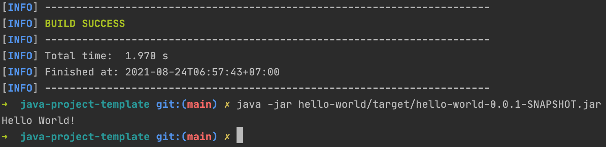

The example project for Command Pattern

<div align="center">
    
</div>

## Prerequisites
Make sure following software is installed on your PC
- [JDK 17](https://www.oracle.com/java/technologies/downloads/#java17) or later

## Project structure
```
.
├── command-pattern
│   ├── pom.xml
│   ...
├── pom.xml
|
└── README.md
```

## Start project

```shell
$ ./mvnw clean package
$ java -jar ./command-pattern/target/command-pattern-0.0.1-SNAPSHOT.jar
14:16:04.440 [main] INFO io.github.huypva.commandpattern.Receiver -- Receiver execute1
14:16:04.443 [main] INFO io.github.huypva.commandpattern.Receiver -- Receiver execute2
```

## Contribute
The code is open sourced. I encourage fellow developers to contribute and help improve it!

- Fork it
- Create your feature branch (git checkout -b new-feature)
- Ensure all tests are passing
- Commit your changes (git commit -am 'Add some feature')
- Push to the branch (git push origin my-new-feature)
- Create new Pull Request

## Reference
- https://en.wikipedia.org/wiki/Command_pattern
- https://refactoring.guru/design-patterns/command